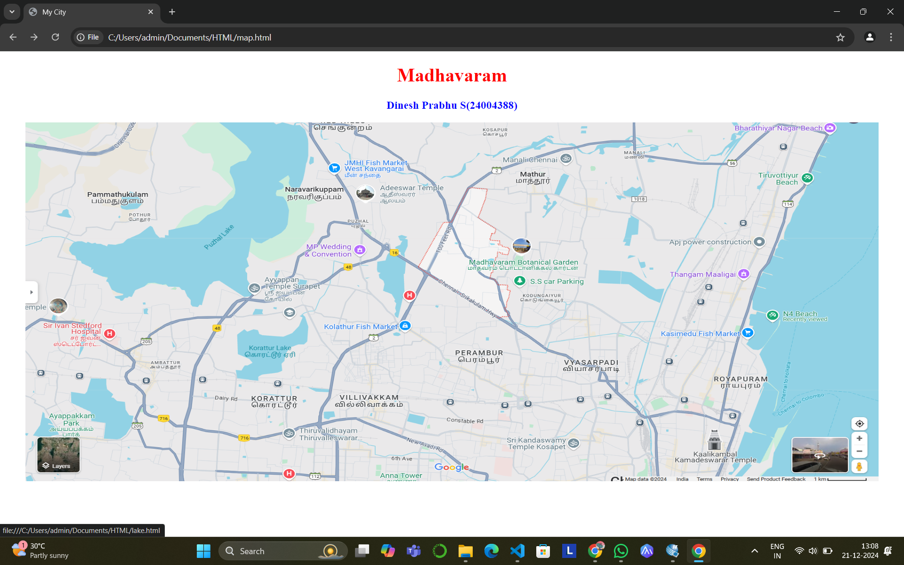
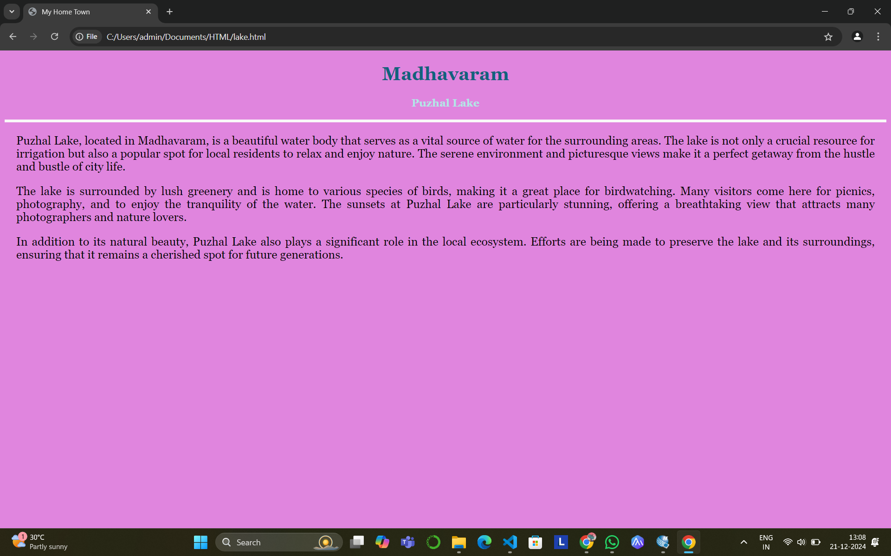
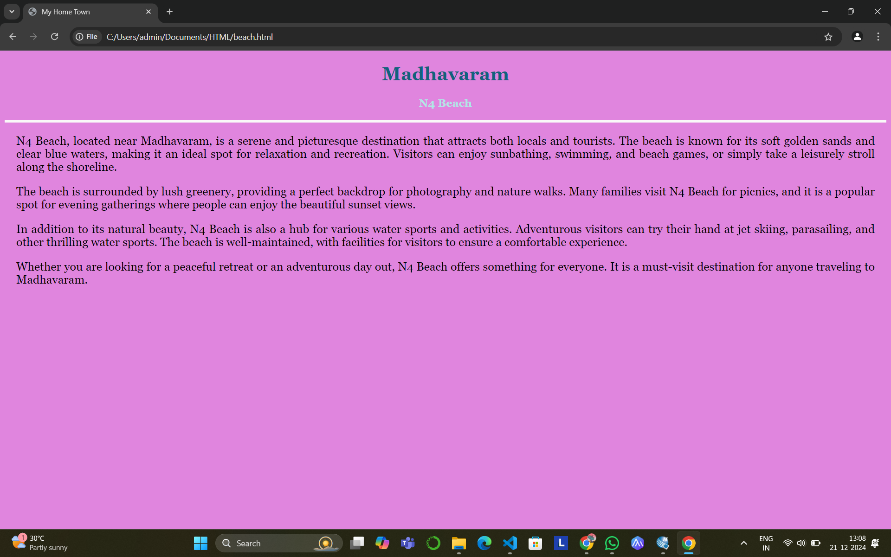
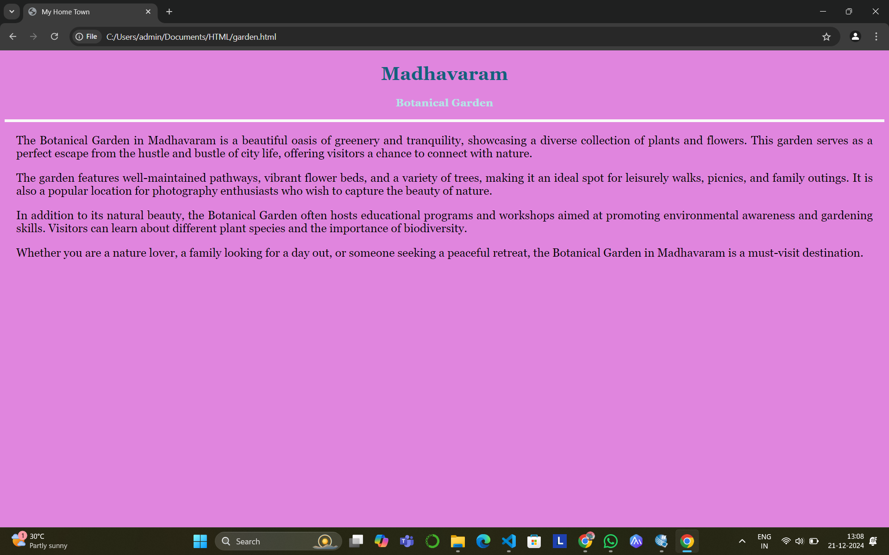
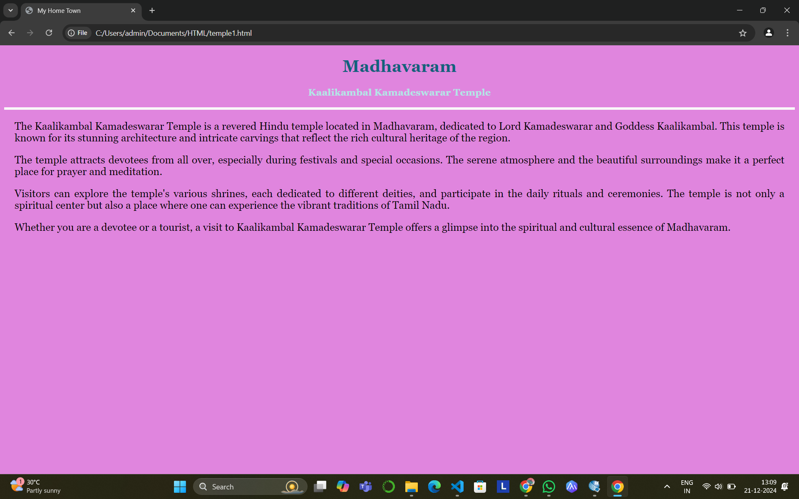
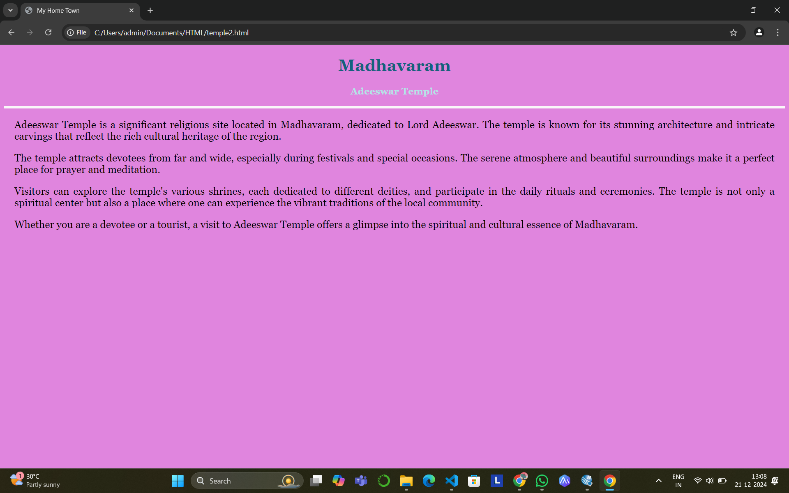

# Ex04 Places Around Me
## Date: 21.12.2024

## AIM
To develop a website to display details about the places around my house.

## DESIGN STEPS

### STEP 1
Create a Django admin interface.

### STEP 2
Download your city map from Google.

### STEP 3
Using ```<map>``` tag name the map.

### STEP 4
Create clickable regions in the image using ```<area>``` tag.

### STEP 5
Write HTML programs for all the regions identified.

### STEP 6
Execute the programs and publish them.

## CODE

**map.html**

```
<!DOCTYPE html>
<html lang="en">

<head>
    <meta charset="UTF-8">
    <meta name="viewport" content="width=device-width, initial-scale=1.0">
    <title>My City</title>
</head>

<body>

    <h1 align="center">
        <font color="red"><b>Madhavaram</b></font>
    </h1>

    <h3 align="center">
        <font color="blue"><b>Dinesh Prabhu S(24004388)</b></font>
    </h3>

    <center>
        

        <map name="MyCity">
            <area target="" alt="Puzhal Lake" title="Puzhal Lake" href="lake.html" coords="157,-1,435,306" shape="rect">
            <area target="" alt="N4 Beach" title="N4 Beach" href="beach.html" coords="1126,266,1279,469" shape="rect">
            <area target="" alt="Botanical  Garden" title="Botanical  Garden" href="garden.html" coords="807,193,1019,305" shape="rect">
            <area target="" alt="Kaalikambal Kamadeswarar Temple" title="Kaalikambal Kamadeswarar Temple" href="temple1.html" coords="1038,520,1226,622" shape="rect">
            <area target="" alt="Adeeswar Temple" title="Adeeswar Temple" href="temple2.html" coords="497,104,716,179" shape="rect">
        </map>

    </center>

</body>

</html>
```

**lake.html**
```
<!DOCTYPE html>
<html lang="en">

<head>
    <meta charset="UTF-8">
    <meta name="viewport" content="width=device-width, initial-scale=1.0">
    <title>My Home Town</title>
    <style>
        body {
            background-color: rgb(224, 133, 222);
            font-family: Georgia, serif;
        }
        h1 {
            color: rgb(19, 97, 125);
            text-align: center;
        }
        h3 {
            color: rgb(177, 230, 230);
            text-align: center;
        }
        hr {
            border: 3px solid rgb(249, 248, 248);
        }
        p {
            font-size: 20px;
            text-align: justify;
            margin: 20px;
        }
    </style>
</head>

<body>

    <h1>Madhavaram</h1>

    <h3>Puzhal Lake</h3>

    <hr>

    <p>
        Puzhal Lake, located in Madhavaram, is a beautiful water body that serves as a vital source of water for the surrounding areas. The lake is not only a crucial resource for irrigation but also a popular spot for local residents to relax and enjoy nature. The serene environment and picturesque views make it a perfect getaway from the hustle and bustle of city life.
    </p>

    <p>
        The lake is surrounded by lush greenery and is home to various species of birds, making it a great place for birdwatching. Many visitors come here for picnics, photography, and to enjoy the tranquility of the water. The sunsets at Puzhal Lake are particularly stunning, offering a breathtaking view that attracts many photographers and nature lovers.
    </p>

    <p>
        In addition to its natural beauty, Puzhal Lake also plays a significant role in the local ecosystem. Efforts are being made to preserve the lake and its surroundings, ensuring that it remains a cherished spot for future generations.
    </p>

</body>

</html>
```

**beach.html**
```
<!DOCTYPE html>
<html lang="en">

<head>
    <meta charset="UTF-8">
    <meta name="viewport" content="width=device-width, initial-scale=1.0">
    <title>My Home Town</title>
    <style>
        body {
            background-color: rgb(224, 133, 222);
            font-family: Georgia, serif;
        }
        h1 {
            color: rgb(19, 97, 125);
            text-align: center;
        }
        h3 {
            color: rgb(177, 230, 230);
            text-align: center;
        }
        hr {
            border: 3px solid rgb(249, 248, 248);
        }
        p {
            font-size: 20px;
            text-align: justify;
            margin: 20px;
        }
    </style>
</head>

<body>

    <h1>Madhavaram</h1>

    <h3>N4 Beach</h3>
    <hr>
    <p>
        N4 Beach, located near Madhavaram, is a serene and picturesque destination that attracts both locals and tourists. The beach is known for its soft golden sands and clear blue waters, making it an ideal spot for relaxation and recreation. Visitors can enjoy sunbathing, swimming, and beach games, or simply take a leisurely stroll along the shoreline.
    </p>

    <p>
        The beach is surrounded by lush greenery, providing a perfect backdrop for photography and nature walks. Many families visit N4 Beach for picnics, and it is a popular spot for evening gatherings where people can enjoy the beautiful sunset views.
    </p>

    <p>
        In addition to its natural beauty, N4 Beach is also a hub for various water sports and activities. Adventurous visitors can try their hand at jet skiing, parasailing, and other thrilling water sports. The beach is well-maintained, with facilities for visitors to ensure a comfortable experience.
    </p>

    <p>
        Whether you are looking for a peaceful retreat or an adventurous day out, N4 Beach offers something for everyone. It is a must-visit destination for anyone traveling to Madhavaram.
    </p>

</body>

</html>
```

**garden.html**
```
<!DOCTYPE html>
<html lang="en">

<head>
    <meta charset="UTF-8">
    <meta name="viewport" content="width=device-width, initial-scale=1.0">
    <title>My Home Town</title>
    <style>
        body {
            background-color: rgb(224, 133, 222);
            font-family: Georgia, serif;
        }
        h1 {
            color: rgb(19, 97, 125);
            text-align: center;
        }
        h3 {
            color: rgb(177, 230, 230);
            text-align: center;
        }
        hr {
            border: 3px solid rgb(249, 248, 248);
        }
        p {
            font-size: 20px;
            text-align: justify;
            margin: 20px;
        }
    </style>
</head>

<body>

    <h1>Madhavaram</h1>

    <h3>Botanical Garden</h3>

    <hr>

    <p>
        The Botanical Garden in Madhavaram is a beautiful oasis of greenery and tranquility, showcasing a diverse collection of plants and flowers. This garden serves as a perfect escape from the hustle and bustle of city life, offering visitors a chance to connect with nature.
    </p>

    <p>
        The garden features well-maintained pathways, vibrant flower beds, and a variety of trees, making it an ideal spot for leisurely walks, picnics, and family outings. It is also a popular location for photography enthusiasts who wish to capture the beauty of nature.
    </p>

    <p>
        In addition to its natural beauty, the Botanical Garden often hosts educational programs and workshops aimed at promoting environmental awareness and gardening skills. Visitors can learn about different plant species and the importance of biodiversity.
    </p>

    <p>
        Whether you are a nature lover, a family looking for a day out, or someone seeking a peaceful retreat, the Botanical Garden in Madhavaram is a must-visit destination.
    </p>

</body>

</html>
```

**temple1.html**
```
<!DOCTYPE html>
<html lang="en">

<head>
    <meta charset="UTF-8">
    <meta name="viewport" content="width=device-width, initial-scale=1.0">
    <title>My Home Town</title>
    <style>
         body {
            background-color: rgb(224, 133, 222);
            font-family: Georgia, serif;
        }
        h1 {
            color: rgb(19, 97, 125);
            text-align: center;
        }
        h3 {
            color: rgb(177, 230, 230);
            text-align: center;
        }
        hr {
            border: 3px solid rgb(249, 248, 248);
        }
        p {
            font-size: 20px;
            text-align: justify;
            margin: 20px;
        }
        
    </style>
</head>

<body>

    <h1>Madhavaram</h1>

    <h3>Kaalikambal Kamadeswarar Temple</h3>

    <hr>
    <p>
        The Kaalikambal Kamadeswarar Temple is a revered Hindu temple located in Madhavaram, dedicated to Lord Kamadeswarar and Goddess Kaalikambal. This temple is known for its stunning architecture and intricate carvings that reflect the rich cultural heritage of the region.
    </p>

    <p>
        The temple attracts devotees from all over, especially during festivals and special occasions. The serene atmosphere and the beautiful surroundings make it a perfect place for prayer and meditation.
    </p>

    <p>
        Visitors can explore the temple's various shrines, each dedicated to different deities, and participate in the daily rituals and ceremonies. The temple is not only a spiritual center but also a place where one can experience the vibrant traditions of Tamil Nadu.
    </p>

    <p>
        Whether you are a devotee or a tourist, a visit to Kaalikambal Kamadeswarar Temple offers a glimpse into the spiritual and cultural essence of Madhavaram.
    </p>

</body>

</html>
```

**temple2.html**
```
<!DOCTYPE html>
<html lang="en">

<head>
    <meta charset="UTF-8">
    <meta name="viewport" content="width=device-width, initial-scale=1.0">
    <title>My Home Town</title>
    <style>
        body {
            background-color: rgb(224, 133, 222);
            font-family: Georgia, serif;
        }
        h1 {
            color: rgb(19, 97, 125);
            text-align: center;
        }
        h3 {
            color: rgb(177, 230, 230);
            text-align: center;
        }
        hr {
            border: 3px solid rgb(249, 248, 248);
        }
        p {
            font-size: 20px;
            text-align: justify;
            margin: 20px;
        }
        
    </style>

<body>

    <h1>Madhavaram</h1>

    <h3>Adeeswar Temple</h3>

    <hr>

    <p>
        Adeeswar Temple is a significant religious site located in Madhavaram, dedicated to Lord Adeeswar. The temple is known for its stunning architecture and intricate carvings that reflect the rich cultural heritage of the region.
    </p>

    <p>
        The temple attracts devotees from far and wide, especially during festivals and special occasions. The serene atmosphere and beautiful surroundings make it a perfect place for prayer and meditation.
    </p>

    <p>
        Visitors can explore the temple's various shrines, each dedicated to different deities, and participate in the daily rituals and ceremonies. The temple is not only a spiritual center but also a place where one can experience the vibrant traditions of the local community.
    </p>

    <p>
        Whether you are a devotee or a tourist, a visit to Adeeswar Temple offers a glimpse into the spiritual and cultural essence of Madhavaram.
    </p>

</body>

</html>
```
## OUTPUT








## RESULT
The program for implementing image maps using HTML is executed successfully.
